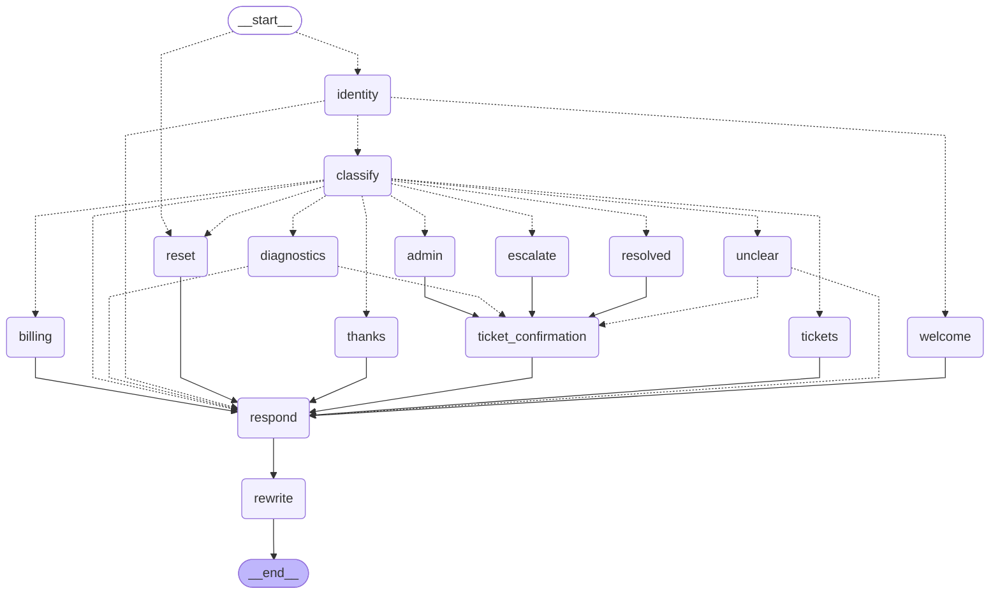

# ISP Support Agent

A LangGraph agent for internet-provider support chats in Spanish. It verifies the customer, answers billing and ticket questions, runs connection checks and opens a ticket once the customer agrees. Technical evidence goes to staff, never to the customer. The ticket API and the network are simulated.

## Graph

Three subgraphs handle identity, parallel diagnostics and ticket confirmation. [Expanded graph](docs/graph.mmd) · [architecture](docs/architecture.md).



## Quickstart

```sh
docker compose up --build        # demo at http://127.0.0.1:5000
```

Or with Python 3.12:

```sh
pip install -e '.[dev]'
isp-agent demo                   # replays every scenario offline
isp-agent chat --scenario healthy
```

The demo runs offline with a rule-based stand-in for the model. Log in with `cliente 12`, then `1234`. To use a real model, fill in [.env.example](.env.example) for Ollama or any OpenAI-compatible API, or start the bundled Ollama profile (see [deploying](docs/deploy.md)). `AGENT_COMPANY_NAME` and `AGENT_BOT_NAME` set the name customers see.

## A conversation

> **Customer:** El internet está muy lento desde ayer  
> **Agent:** Para empezar, escribe tu número de cliente, por ejemplo: cliente 12. Si no lo recuerdas, consulta tu recibo o comunícate con nosotros por teléfono.  
> **Customer:** cliente 12  
> **Agent:** Para verificar tu identidad, escribe los últimos cuatro dígitos del teléfono registrado.  
> **Customer:** 1234  
> **Agent:** Revisé tu enlace y la señal llega débil. Hace falta que el equipo técnico lo revise. ¿Quieres que abra un reporte para dar seguimiento? Responde sí o no.  
> **Customer:** Sí, por favor  
> **Agent:** Tu solicitud quedó registrada con el folio 1001. El equipo de soporte le dará seguimiento.

More in [docs/transcripts](docs/transcripts/), including a vague message that gets one clarifying question before the diagnosis.

## How it decides

- Keyword rules read every message first. If they or the model detect a full outage, a red light or a cut cable, staff get an alert right away.
- The model picks the intent and returns structured output. If it isn't confident, the agent asks one clarifying question, with a few phrases the customer can type.
- Four connection checks run in parallel, each with its own timeout. A fixed table turns their results into one of six verdicts; the model never decides the diagnosis.
- Identity checks and ticket changes pause the graph with `interrupt()` and wait for the customer. Ticket writes are deduplicated and idempotent.
- Replies come from templates. With a live model, the model may reorder the template's sentences and add one short courtesy phrase at the start (or a thanks at the end). A validator rejects anything else, and the template is sent.

## Results

**Blind set.** 50 messages written by Gemini and Grok in fresh chats, from the intent definitions alone, with labels checked by hand before scoring. They are synthetic, not real customer messages.

| | Accuracy | Critical caught |
| --- | --- | --- |
| Rules only | 37/50 | 12/17 |
| Model only | 47/50 | 16/17 |
| Rules + model | 48/50 | 17/17 |
| Through the full graph | 48/50 | 17/17 |

**Dev** (104 messages, used to build the prompt): 98/104 through the graph, 36/36 critical.
**Test** (102 messages written during development, so not independent; expect an optimistic score): 100/102 through the graph, 30/30 critical. Rules alone catch 17/30.

**Reply rewriting.** In 70 recorded conversations with the local model (381 replies), 262 of 294 rewrite attempts were sent. 27 ran out of time, 4 dropped a required sentence and 1 put an acknowledgement after the closing question, so the template went out instead. No reply leaked technical data, and every required fact was kept. A full turn, classification included, takes about 4 s at the median and reaches the 8 s cap at p95 on a laptop. An earlier trial missed the 3 s target set before it (4.3 s at p95 for the rewrite alone); after seeing that, the limit was raised to 8 s, since a few seconds is normal in a WhatsApp chat, and the rewritten replies were preferred in a side-by-side read.

If the model is down or slow and the rules don't recognize a message, the customer gets a clarifying question and staff get an "unclassified message" alert, so a missed outage still reaches a person.

CI replays recorded model outputs through the current graph, so routing changes are tested without a model. It fails when the prompt, rules or data change without a new recording. Details: [evaluation](docs/evaluation.md), [classifier results](docs/eval-ollama.md), [rewrite results](docs/rewrite-results.md).

## Safety

- Conversations are isolated per sender by the checkpointer; staff notes never reach the customer channel.
- Three wrong phone codes lock the account for 15 minutes, across resets and new senders.
- The WhatsApp webhook checks signatures on the raw body, rejects stale timestamps, deduplicates message IDs and answers before processing. Customers see "typing…" while the agent works.
- Rate limits, a per-customer diagnostic gate and an eight-second model budget per turn bound the work.

## Deploying

Docker image (non-root, health and readiness checks, a volume for conversation state), an optional Ollama profile that pulls the model, WhatsApp Cloud API setup, TLS proxy notes and how to plug in your own ticket system and network checks: [docs/deploy.md](docs/deploy.md).

## Limits

Not tested against a real ticket system, network devices, live WhatsApp delivery or a hosted OpenAI-compatible model. It runs as a single process. Anyone who types three wrong codes can lock an account for 15 minutes, and there's no notification for the account holder. The rewrite validator checks literal sentences, not meaning. The evaluation messages are synthetic.

Built for GNS's customer-support flow during a university project, then reworked into this version. It runs against a mock ticket API and a simulated network and was never connected to GNS's systems.

## License

[MIT](LICENSE)
